# Swed News

Swedish News Hub is an online platform that offers the latest news updates from Sweden. It allows users to read news articles and actively engage with the content through comments and likes.

Additionally, the Code Institute hosts various Python-based projects on their mock terminal platform on Heroku, providing a diverse range of educational and interactive experiences.

 [View the live site here](https://swed-news-cf4db223443b.herokuapp.com/)

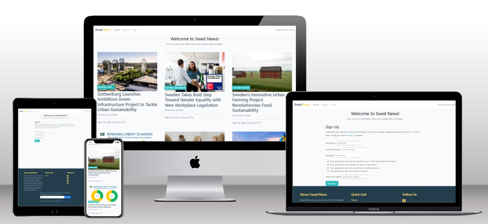

## Description

Swed News, is a go-to platform for comprehensive insights on Sweden. The user can explore a diverse range of topics, personalize news feed, and engage with a vibrant community. Trust in our accurate and unbiased reporting to enhance understanding of Sweden. Users have the option to register for an account, and anyone is welcome to subscribe to our email newsletter.

## Features 

### Navigation Section

* The navigation here is visible to all users before the user sign in, it includes:
  * Home  
  * Register
  * Login

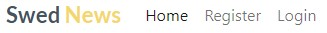

* The navigation here is exclusively visible to logged-in users and includes:
  * Home  
  * Logout

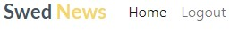

* Home
  * This will lead to the landing page containing all the essential information.

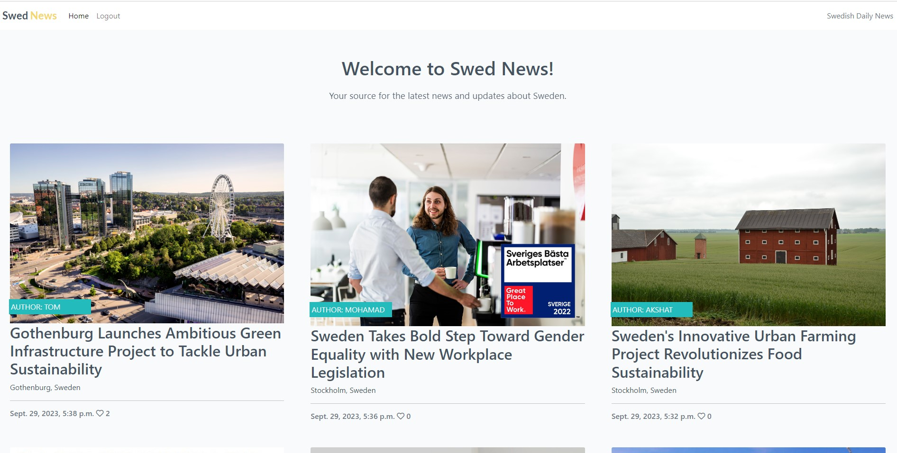

* Register
  * This will redirect the user to the registration page where they can input all the necessary information to create an account.

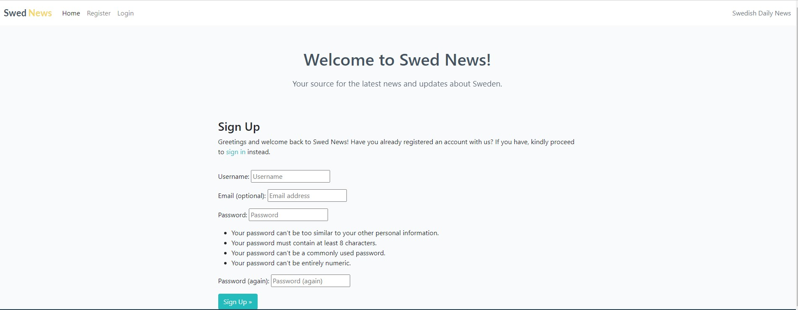

* Login
  * This will direct the user to the login page, where they can enter their details to access the functions available for logged-in users.

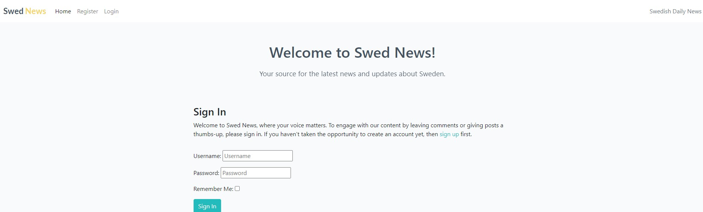

* Logout
  * This will direct the user to the logout page, allowing them to log out from the system.
  
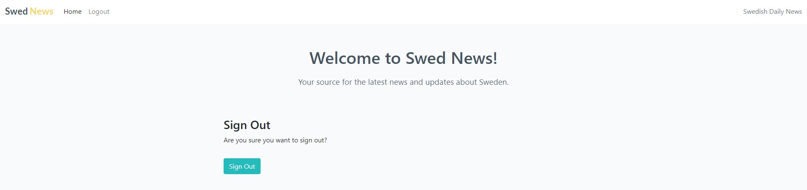

### Message Notification

* Message notifications deliver important information to users when they take significant actions. For instance, these messages will appear briefly for 2.5 seconds few exampels:
  * Signing in or out  
  * Entering their email to subscribe
  * Entering their email to subscribe while they already did

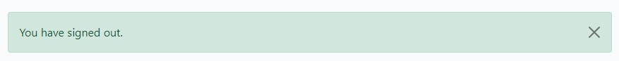

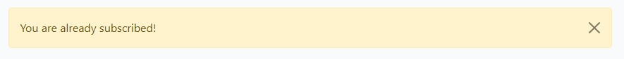

### Newsletter Subscription

* Newsletter subscription enables users to enter their email address to subscribe and receive the latest news updates from Swed News.
  
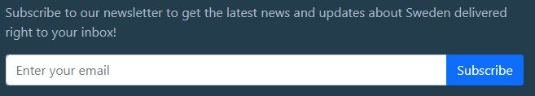

### Footer

* The footer contains a variety of information which include:
  * Quick links  
  * Newsletter subscription
  * Social media links
  * Contact email
  

### Posting and Liking Comments

* Below, there are two types of users: one who is signed in, allowing them to post, like comments, and interact with posts, while the other type can only read the posts, but they can see the number of likes each post has.
  
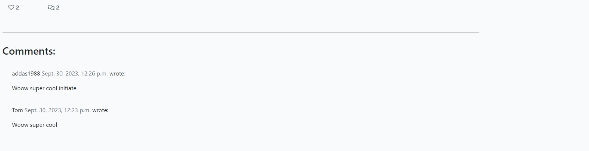

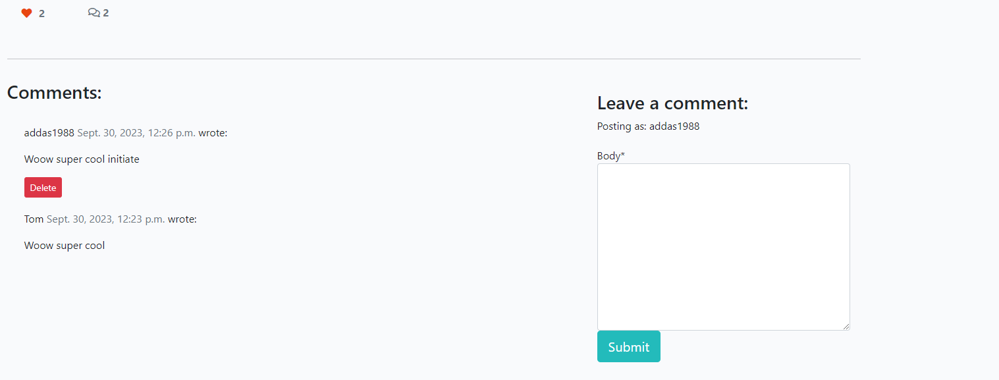

* Signed-in users can post comments, but their comments require approval from the admin before they are published.

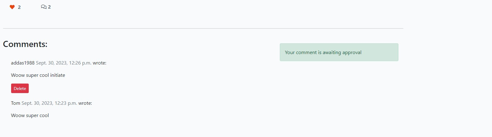

### Django Admin Panel

* Within the Admin Panel, as an admin or superuser, I possess comprehensive control over CRUD operations. This means I have the authority to perform the following actions on various entities:
  * Posts: I can view, create, edit, and delete posts. 
  * Comments: I can view, approve, and delete comments.
  * Profiles: I can oversee user profiles, including making changes or deletions.
  
  
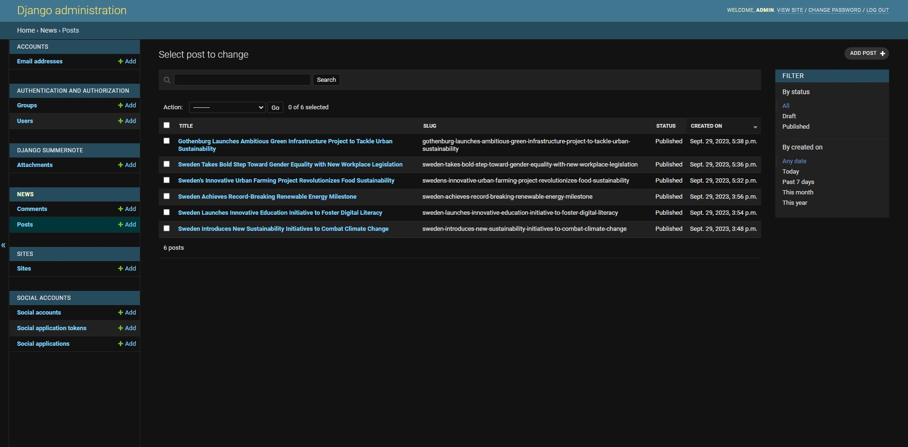

### Future Features 

* Allow User to be able to edit their post.
* Creating different category for news.

## Technologies

* HTML
    * The structure of the Website was developed using HTML as the main language.   
* CSS
    * The Website was styled using custom CSS in an external file.   
* Python
    * The Website was animated using custom Python in an external file.    
* GitHub
    * Source code is hosted on GitHub and delpoyed using Git Pages.
* Git 
    * Used to commit and push code during the development opf the Website
* Heroku
    * Source code is hosted on Heroku and delpoyed.
* Tinyjpg
    * https://tinyjpg.com/ was used to reduce the size of the images used throughout the website
* Bootstrap
    * It was employed to design the website, enhance its responsiveness, and introduce interactivity.   
* PostgreSQL
    * The database was accessed via Heroku. 
* Gunicorn 
    * Played the role of hosting our static files and media content.
* Cloudinary 
    * It was employed to design the website, enhance its responsiveness, and introduce interactivity.   
* Psycopg2 
    * Acted as a connector between Python and PostgreSQL databases.  
* Summernote  
    * Was used as a rich text editor within the application.
* Allauth  
    * Provided the necessary functionalities for authentication, registration, and account management.  
* Crispy Forms 
    * Contributed to the aesthetic styling of our forms.       

## Data Model 

Post Model:

Fields:

* title (CharField): The title of the post, limited to 200 characters.
* slug (SlugField): A unique slug for the post URL, also limited to 200 characters.
* author (ForeignKey to User model): The author of the post, linked to the Django User model.
* featured_image (CloudinaryField): An image associated with the post, stored using Cloudinary.
* excerpt (TextField): A brief excerpt or summary of the post content.
* updated_on (DateTimeField): The date and time when the post was last updated.
* content (TextField): The main content of the post.
* created_on (DateTimeField): The date and time when the post was created.
* status (IntegerField with choices): Indicates whether the post is a draft (0) or published (1).
* likes (ManyToManyField to User model): Users who have liked the post.

Comment Model:

Fields:

* post (ForeignKey to Post model): The post to which the comment is associated.
* name (CharField): The name of the commenter.
* email (EmailField): The email address of the commenter.
* body (TextField): The content of the comment.
* created_on (DateTimeField): The date and time when the comment was created.
* approved (BooleanField): Indicates whether the comment is approved (True) or not (False).
* deleted (BooleanField): Indicates whether the comment is deleted (True) or not (False).
* User Model (from Django's built-in User model):

Django's built-in User model is extended to include additional user-related information and fields, such as username, password, email, and more. It's used for user registration and authentication in your application.

This data model is designed to manage posts, comments, and user-related information in your Django project. Posts are associated with authors, have featured images stored in Cloudinary, and support post likes through a ManyToMany relationship with the User model. Comments are associated with specific posts, and user-related information is extended from Django's built-in User model for user registration and authentication.

## Testing

### Responsiveness

All pages were tested to ensure responsiveness on screen sizes from 320px and upwards as defined in [WCAG 2.1 Reflow criteria for responsive design](https://www.w3.org/WAI/WCAG21/Understanding/reflow.html) on Chrome, Edge, Firefox and Opera browsers.

Steps to test:

1. Open browser and navigate to [Swed News](https://swed-news-cf4db223443b.herokuapp.com/)
2. Open the developer tools (right click and inspect)
3. Set to responsive and decrease width to 320px
4. Set the zoom to 50%
5. Click and drag the responsive window to maximum width

Website is responsive on all screen sizes and no images are pixelated or stretched.
No horizontal scroll is present.
No elements overlap.

### Accessibility

[Wave Accessibility](https://wave.webaim.org/) tool was used throughout development and for final testing of the deployed website to check for any aid accessibility testing.

Testing was focused to ensure the following criteria were met:

- All forms have associated labels or aria-labels so that this is read out on a screen reader to users who tab to form inputs
- Color contrasts meet a minimum ratio as specified in [WCAG 2.1 Contrast Guidelines](https://www.w3.org/WAI/WCAG21/Understanding/contrast-minimum.html)
- Heading levels are not missed or skipped to ensure the importance of content is relayed correctly to the end user
- All content is contained within landmarks to ensure ease of use for assistive technology, allowing the user to navigate by page regions
- All not textual content had alternative text or titles so descriptions are read out to screen readers
- HTML page lang attribute has been set
- Aria properties have been implemented correctly
- WCAG 2.1 Coding best practices being followed

Manual tests were also performed to ensure the website was accessible as possible and an accessibility issue was identified.

### I have manually tested the website:

1. Functional Testing:

a. Navigation Testing: Verify that all navigation links in the header and footer work correctly and take users to the intended pages. This includes testing links to the home page, login, registration, and individual post pages.

b. User Registration: Test the user registration process by filling out the registration form with valid and invalid data. Ensure that users can successfully create accounts and are redirected to the appropriate pages.

c. User Login and Logout: Test the login and logout functionality by entering valid and invalid credentials. Ensure users can log in and out successfully, and that they are redirected to the correct pages.

d. Commenting: Check if users can submit comments on individual post pages. Verify that comments appear on the page after submission and that users can edit or delete their comments if applicable.

e. Like Button: Test the "like" functionality on individual post pages. Ensure users can like and unlike posts, and that the like count updates accordingly.
f. Post Creation: If applicable, test the creation of new posts from the admin panel. Verify that posts appear correctly on the home page.

2.	Visual Testing:

a. Layout and Design: Review the overall layout and design of the website. Check for consistency in fonts, colors, and spacing. Ensure that the website is visually appealing and easy to read.

b. Responsive Design: Test the website on various screen sizes and devices (e.g., desktop, tablet, mobile). Verify that the website is responsive and that content is displayed correctly on all devices.

c. Images and Media: Ensure that images and media elements (e.g., featured images) load properly and are displayed in the correct aspect ratio. Test with different types of images and verify that they are displayed without distortion.

d. Forms and Input Fields: Verify that all forms and input fields have appropriate labels and placeholders. Check for validation messages and error handling when submitting forms with incorrect data.

3.	Accessibility Testing:

a. Keyboard Navigation: Test the website's accessibility using only the keyboard. Ensure that all interactive elements (links, buttons, forms) are accessible and can be activated using keyboard shortcuts.

b. Screen Reader Compatibility: Use screen reader software to test the website's compatibility with assistive technologies. Ensure that all content is read aloud accurately and that images have appropriate alt text.

4.	Performance Testing:

a. Page Load Speed: Evaluate the website's performance in terms of page load speed. Tools like Google PageSpeed Insights can help identify areas for improvement.

b. Content Loading: Check that content, especially images and videos, loads quickly and without delay. Optimize media files if necessary.

I tested several situations:

* I keep the sign up form empty and I pressed perocced and it didn't go throug as expected.

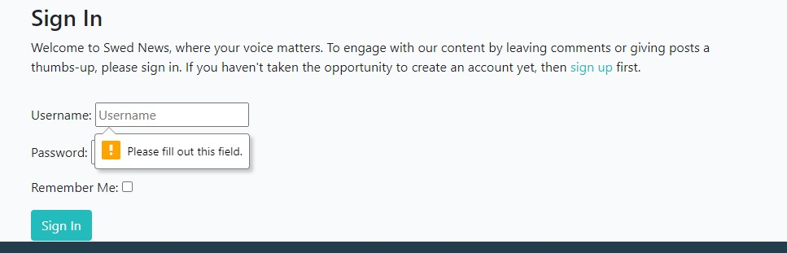

* I keep the password field empty and I pressed perocced and it didn't go throug as expected.

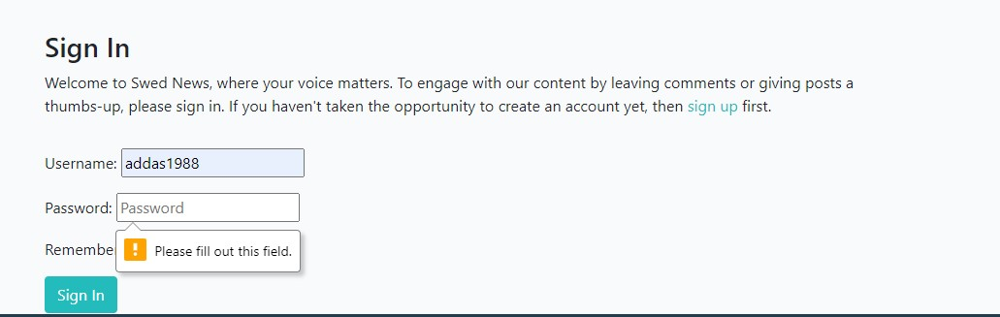

* I keept the password and user field empty and I pressed perocced and it didn't go throug as expected.

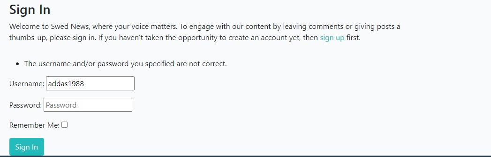

Overall, I conducted manual testing on the website, focusing primarily on the registration and sign-in processes. During the testing phase, I carefully observed how the system behaved when a user attempted to register and sign in. I verified that error handling mechanisms were functioning as expected

### Bugs

### Solved Bugs

* Player was able to put numbers also for guessing the word. I fixed it by adding guess.isalpha() so incase the player input number will get error saying "Invalid input. Please enter a letter." 
* The game was not running and I discover it was because my indication for game.play() was not right. I fixed it and it started working
* When the game ends and I reset the game and I was getting the welcome message however it was showing me already that I am lost. I fix it by adding def reset_variables.
* When player write letter in capital letter it was not working and player was able to write multiple letters without issue. I fix it by adding .lower() to the guess variabile and adding "or len(guess) > 1" for the "if not guess.isalpha()"

### Remaining Bugs

* No bugs remaining

### Validator Testing

* PEP8
  * Two errors were returned from pep8ci.herokuapp.com for line too long will fix it in the new release.

### Deployment

This project was deoplyed using Code Institut's mock terminal for Heroku

* Steps for deployment:
    * Fork or clone this repository
    * Create a new Heroku app
    * Set the buildbacks to Python and NodeJS in that order
    * Link the Heroku app to the repository
    * Click on Deploy

### Credits

* Code Institute for the deployment terminal.
* Code Institute Love Sandwishes Project for inspiration and practice.
* Code Institute Battleship Game Project for inspiration and practice.
* Slack groups it gives me good inspiration.  

